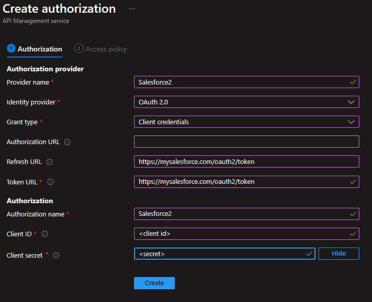

# Autheorize to backend API using OAuth2

Configures APIM to acquire an OAuth2 token from an authorization server and use it in the call to the backend API.
[Reference documentation](https://learn.microsoft.com/en-us/azure/api-management/authorizations-overview).

## Setup

I could not fathom why this feature supports Authorization Code OAuth2 flow but not Extension (OBO) flow! The first one is
user facing (requires user interaction) while APIM is never user facing - it is used by client applications. OBO would be much more appropriate use case. Fortunately, the feature does support
Client Credentials flow, which allows APIM to act as a client to the back-end APIs. I will concentrate on that here.

### Configure the Authorization Server

Here is configuration for using Saelsforce using Client Credentials. The out-of-the-box APIM option for Saleforce
supports only Authorization Code grant so we will use the generic OAuth2 provider instead.

