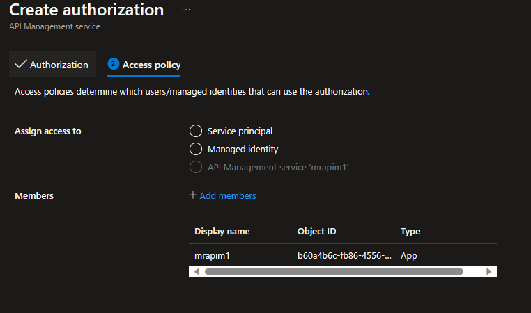
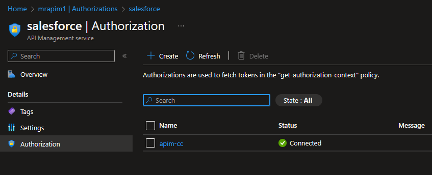

# Autheorize to backend API using OAuth2

Configures APIM to acquire an OAuth2 token from an authorization server and use it in the call to the backend API.
[Reference documentation](https://learn.microsoft.com/en-us/azure/api-management/authorizations-overview).

## Setup

I could not fathom why this feature supports Authorization Code OAuth2 flow but not Extension (OBO) flow! The first one is
user facing (requires user interaction) while APIM is never user facing - it is used by client applications. OBO would be much more appropriate use case. Fortunately, the feature does support
Client Credentials flow, which allows APIM to act as a client to the back-end APIs. I will concentrate on that here.

### Configure the Authorization Server

Here is the configuration for using Salesforce with OAuth2 Client Credentials flow. The out-of-the-box APIM option for Saleforce
supports only Authorization Code grant so we will use the generic OAuth2 provider instead.


### Allow access to authorization server's configuration

Configure authorization for APIM to use the above configuration in policies. Here, I am allowing the Managed Identity associated with this APIM instance
to use Salesforce2 authz server configuration. Note that you need to select 'Add members' after selecting 'API Management service':



(I admit to be somewhat baffled by this step: why do we need to give ourselevs access to something we have just defined?)

### Review

Select the newly defined authorization and select the Authorization option from its option list. You should see successful verification of your configuration



## Use in API policies

Configure your API policies to use the above to acquire tokens and include them in backend calls. You may want to store the below policy fragment in APIM
Fragments.

```xml
<fragment>
	<get-authorization-context provider-id="salesforce" authorization-id="apim-cc" context-variable-name="auth-context" identity-type="managed" ignore-error="false" />
	<set-header name="Authorization" exists-action="override">
		<value>@("Bearer " + ((Authorization)context.Variables.GetValueOrDefault("auth-context"))?.AccessToken)</value>
	</set-header>
</fragment>
```

You can then use this fragment in the API calls which need it:

```xml
<policies>
    <inbound>
        <base />
        <include-fragment fragment-id="authorize-backendcall" />
        ...
    </inbound>
    <backend>
        <base />
    </backend>
    <outbound>
        <base />
    </outbound>
    <on-error>
        <base />
    </on-error>
</policies>
```

